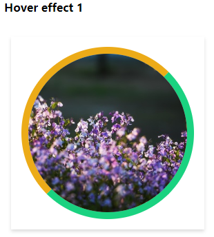
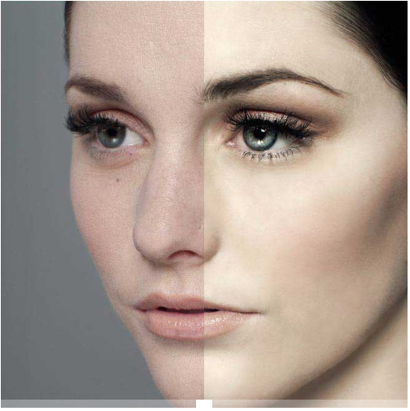
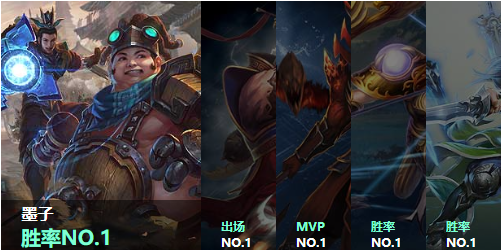
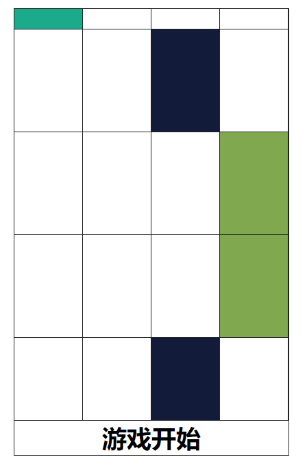

        <h1>bootstrap</h1>
        <a href="Nightdya.github.io/bootstrap/practice01/项目考核/项目考核.html">
        

        
项目一

        </a>
         
        <a href="Nightdya.github.io/bootstrap/practice02/练习2.html">
        

         
项目二

        </a>        

 

        <h1>CSS3</h1>
        <a href="Nightdya.github.io/CSS3/CSS3hover动画.html">
        

        
CSS3hover动画

        </a>
         
        <a href="Nightdya.github.io/CSS3/CSS3统计图.html">
        

        
CSS3统计图

        </a>   
         
        <a href="Nightdya.github.io/CSS3/阴影效果.html">
        

        
阴影效果

        </a> 

 

        <h1>jquery</h1>
        <a href="Nightdya.github.io/jquery/banner/无缝轮播图.html">
        

    
        
无缝轮播图

        </a>
         
        <a href="Nightdya.github.io/jquery/Magnifier/放大镜.html">
        

  
        
放大镜

        </a>     

 

        <h1>javascript</h1>
        <a href="Nightdya.github.io/javascript/美颜对比.html">
        

  
        
美颜对比

        </a>
         
        <a href="Nightdya.github.io/javascript/手风琴.html">
        

  
        
手风琴

        </a>
          
        <a href="Nightdya.github.io/javascript/别踩白方块儿.html">
        

  
        
别踩白方块儿

        </a>  

